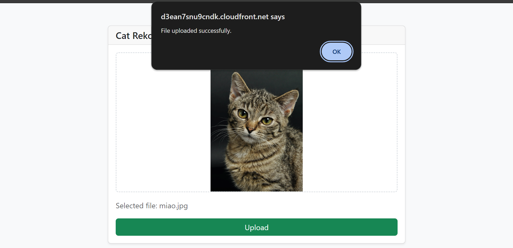
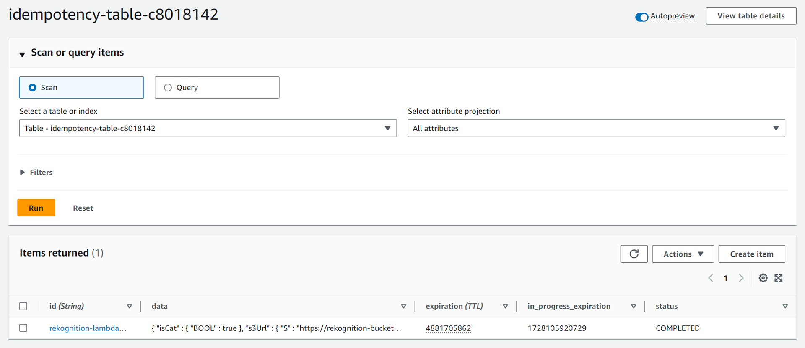

# cdk-aws-cat-rekognizer

CDK app that detects whether an uploaded image contains a cat or not using Amazon Rekognition.

## Prerequisites

- **_AWS:_**
  - Must have authenticated with [Default Credentials](https://docs.aws.amazon.com/cdk/v2/guide/cli.html#cli_auth) in your local environment.
  - Must have completed the [CDK bootstrapping](https://docs.aws.amazon.com/cdk/v2/guide/bootstrapping.html) for the target AWS environment.
- **_Node.js + npm:_**
  - Must be [installed](https://docs.npmjs.com/downloading-and-installing-node-js-and-npm) in your system.

## Installation

```sh
npx projen install
```

## Deployment

```sh
npx projen deploy
```

## Usage

1. Access the website by clicking the `<CLOUDFRONT_DISTRIBUTION_URL>` from the deployment outputs:

   ```sh
   Outputs:
   WebsiteDistributionUrl = <CLOUDFRONT_DISTRIBUTION_URL>
   ```

2. Upload your image from the UI:

   

3. In AWS Console, `DynamoDB` ➜ `idempotency-table-XXXXXXXX`:

   

4. The DynamoDB table displays the cat detection result and S3 URL for unique uploaded images.

## Cleanup

```sh
npx projen destroy
```

## Architecture Diagram


